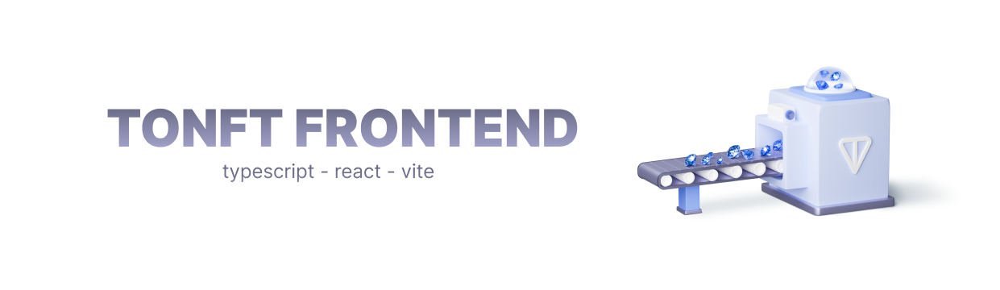

# TONFT | NFT Bazaar Frontend | Hack-a-TONx w/ DoraHacks
Welcome to the TONFT | NFT Bazaar frontend  GitHub repository! This repository contains the frontend code for the first NFT bazaar on TON.

## Prerequisites
Before running the frontend, make sure to have the following installed:

- Node.js
- Yarn package manager

## Getting Started
To run the frontend, follow these steps:

1. Clone this repository `git clone https://github.com/tonft-app/frontend.git`;
1. Install dependencies by running `yarn install`;
1. Run the app  by running `yarn dev`.

The app should now be up and running at http://localhost:5173/. 

Frontend is written using mainly `React`, `TS` +  other libraries.

## Contribution
Pull requests and suggestions are welcome here (https://t.me/alexuniverse12) telegram.

Thank you for using TONFT | NFT Bazaar!
